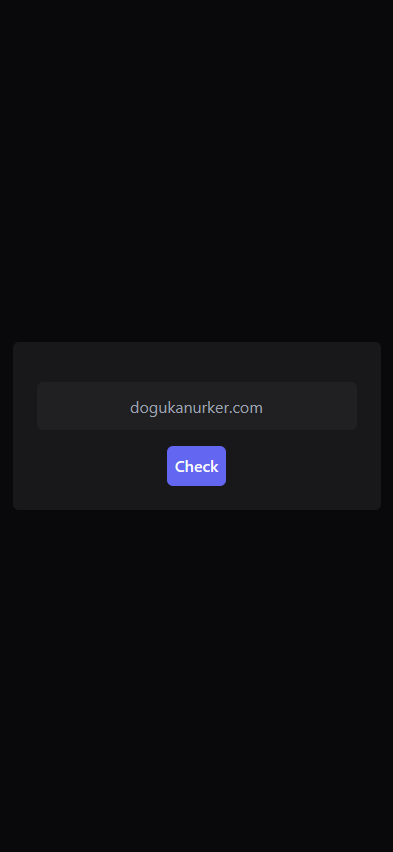

# [BrokenURLChecker🔗](https://dogukanurker.com/brokenurlchecker)

Check whether a link working or not.🖇️
 
[Contact](mailto:dogukanurker@icloud.com) 
[Dogukan Urker](https://dogukanurker.com)

| [Desktop](https://github.com/DogukanUrker/BrokenURLChecker/tree/main/images/desktop) | [Mobile](https://github.com/DogukanUrker/BrokenURLChecker/tree/main/images/mobile) |
| :-----------------------------------------------------------------------------: | :---------------------------------------------------------------------------: |
|                                         |                                       |

[click for more images📷](https://github.com/DogukanUrker/BrokenURLChecker/tree/main/images)

## Requirements 📦

#### Backend
- FastAPI
- Uvicorn
- Pydantic
- Requests
- Python 3.10 or newer

#### Frontend
- React
- Axios
- Node
- Tailwind

## Installation ⬇️

download source code from Github 💾
`git clone https://github.com/DogukanUrker/BrokenURLChecker.git`

go to directory 📁
`cd BrokenURLChecker`
### Backend

go to directory 📁
`cd backend`

install requirements.txt 🔽
`pip install -r requirements.txt`

it's ready to run 🎉
`python app.py`

### Frontend

go to directory 📁
`cd frontend`

install packages 📦
`npm install`

it's ready to run 🎉
`npm run dev`

### Contributors 💕

### Support 💰

